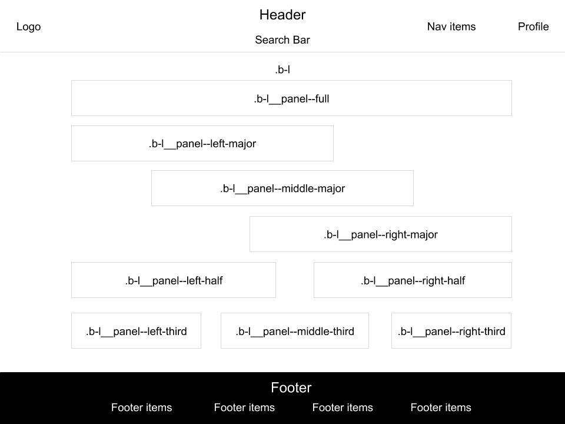
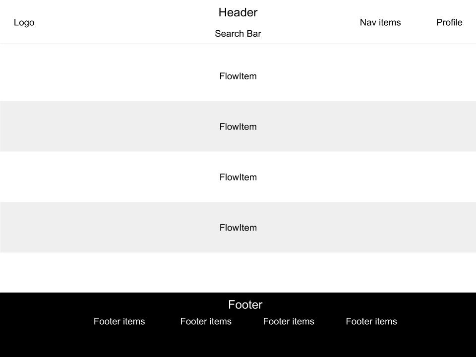
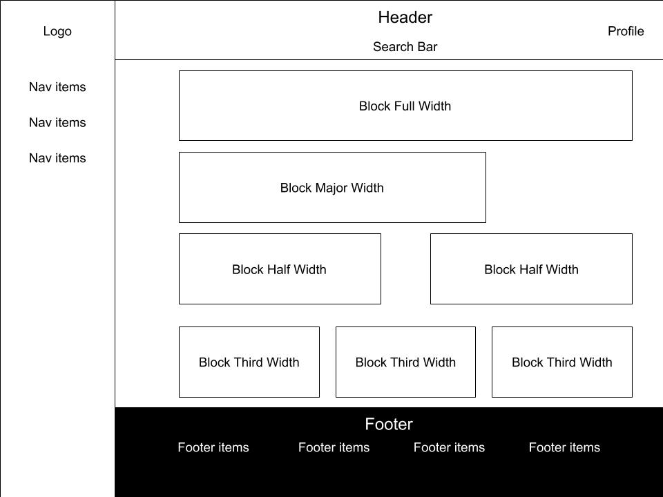

# Factor UI

[](https://travis-ci.com/mozilla-it/factor-ui)

## Project description

This will be a central repository for internally shared templates and components within Mozilla. This README will be the central location for all documentation relating to our internal components.

This project is intended to be a helpful "bootstrapped" kickstarter for all internal applications, providing out of the box internal themes and styles while allowing for flexibility to each individual application.

## Installation

Run the following command in your terminal

```
npm install --save @mozilla/factor-ui
```

## Templates

#### Include

Include this in whichever VueJS component you wish to use the template.

In component import

```
<template>
  <FactorBlockTemplate>
    <div slot="nav" >
      <!-- Nav content -->
    </div>
    <div slot="profile">
      <!-- Profile content -->
    </div>
    <div slot="main">
      <!-- Main content -->
    </div>
    <div slot="footer-links">
      <!-- Links in footer content -->
    </div>
  </FactorBlockTemplate>
</template>

<script>
import { FactorBlockTemplate } from '@mozilla/factor-ui';
import '@mozilla/factor-ui/dist/lib/factor.css';

export default {
  components: {
    FactorBlockTemplate
  },
  data () {
    return {
      value: 0
    }
  }
}
</script>
```

This works the same with each of the different templates: FactorBlockTemplate, FactorFlowTemplate, FactorNavTemplate

#### Api

| Property         | Type                      | Description                                                                  |
| ---------------- | ------------------------- | ---------------------------------------------------------------------------- |
| searchBarHandler | Function \| (value) => {} | Handler function for whatever is returned in the header search bar on update |
| searchBarLabel   | String                    | Default placeholder text for the search bar                                  |

#### Slots

| Name         | Type         | Area                                          |
| ------------ | ------------ | --------------------------------------------- |
| logo         | HTML Element | Upper left logo                               |
| nav          | HTML Element | Upper right nav area next to the profile area |
| profile      | HTML Element | Upper right profile area                      |
| main         | HTML Element | All content between header and footer         |
| footer-links | HTML Element | List of footer links                          |

### Block template



### Flow template



### Nav Template


